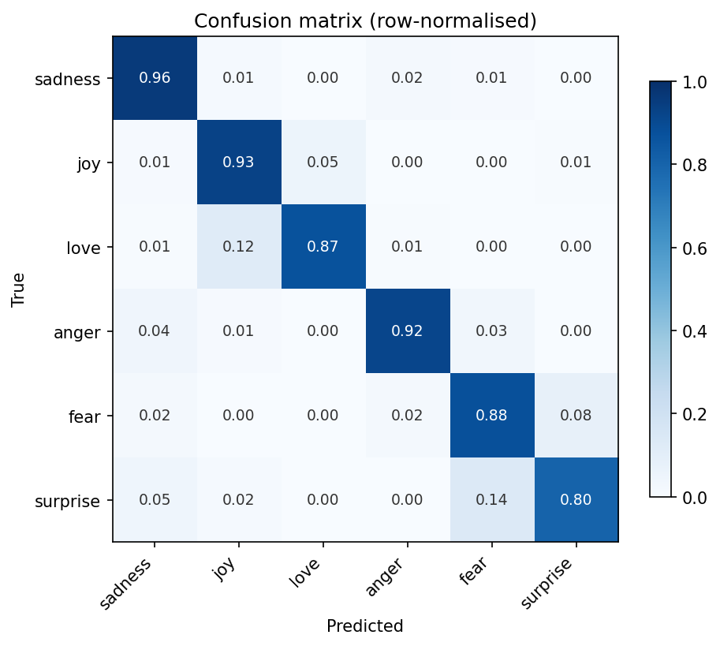

# Emotion Classification with DistilBERT

Fine-tunes `distilbert-base-uncased` on the [dair-ai/emotion](https://huggingface.co/datasets/dair-ai/emotion)
dataset to classify text into six emotions: sadness, joy, love, anger, fear, surprise.

Written with an explicit PyTorch training loop rather than the Hugging Face `Trainer`,
to make the forward/backward/step cycle visible.

## Results

| Metric | Value |
|---|---|
| Validation accuracy | 93.2% |
| Test accuracy | [from Cell G] |
| Macro F1 | [from Cell G] |
| Training time | ~2.7 min (Colab T4) |

Macro F1 sits below accuracy because the dataset is imbalanced — `love` and
`surprise` are heavily under-represented, and `love` is most often confused with `joy`.

## Setup

| Component | Choice |
|---|---|
| Base model | distilbert-base-uncased (66M params) |
| Optimiser | AdamW, lr 2e-5, linear decay |
| Batch size | 32, dynamic padding |
| Epochs | 2 |
| Max sequence length | 128 |

## Running it

Open the notebook in Colab via the badge, set **Runtime → T4 GPU**, and Run All.

## Notes

Built on transformers v5, where tokenizer classes were consolidated — `AutoTokenizer`
returns `BertTokenizer` for DistilBERT checkpoints and emits `token_type_ids`,
which DistilBERT does not accept. The notebook drops that column explicitly.
